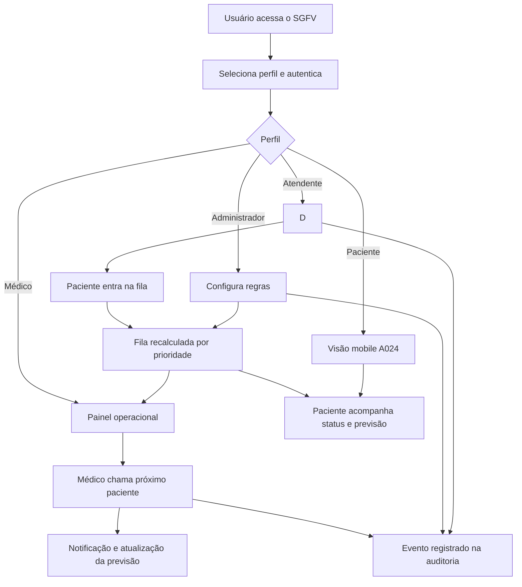

# User Flow - SGFV

## Fluxo principal

1. O usuário acessa `#/login`.
2. O perfil define a área inicial do sistema.
3. Paciente entra na visão mobile de Rafael Costa, senha A024.
4. A visão mobile mostra posição, status e tempo previsto de atendimento.
5. Atendente registra check-in quando necessário.
6. A fila é reorganizada por prioridade, tempo de espera e status.
7. Médico ou equipe operacional chama o próximo paciente.
8. A previsão e o painel operacional refletem a mudança da fila.
9. Eventos sensíveis ficam disponíveis para auditoria.

## Fluxos alternativos representados

- Administrador altera regras de prioridade e força nova leitura operacional da fila.
- Paciente pode acompanhar a fila sem acessar telas administrativas.
- Atendente visualiza operação sem acessar auditoria ou regras administrativas.
